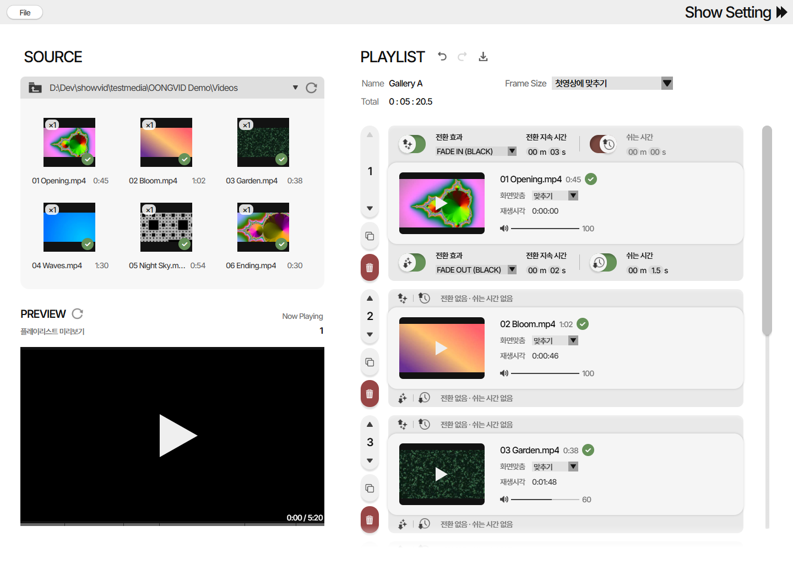
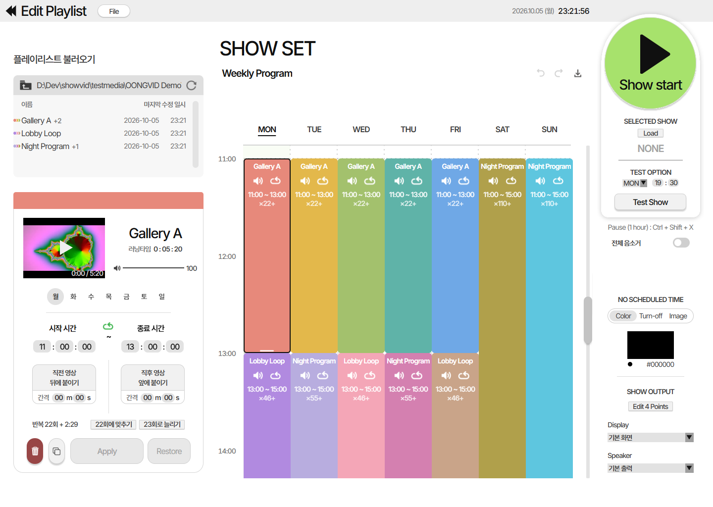
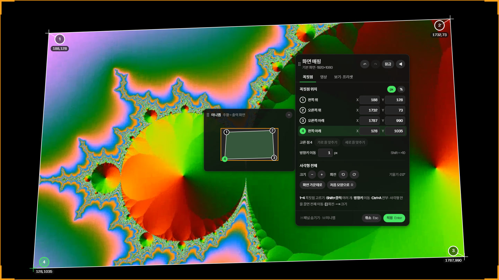

# OONGVID

**전시 공간을 위한 영상 플레이리스트 · 쇼 스케줄 · 화면 매핑 프로그램**

영상을 순서대로 엮어 플레이리스트를 만들고, 요일·시간별 시간표에 올려 두면 전시 기간 내내 정해진 시간에 알아서 틀어 줘요. 빔프로젝터 화면이 비뚤어지면 네 꼭짓점을 끌어서 바로 맞출 수 있어요. 윈도우·맥·라즈베리파이에서 돌아가요.

만든 곳: **OONG Studio**

## ⬇ [최신 버전 받기](https://github.com/seoyoongweb/OONGVID-releases/releases/latest)

| 컴퓨터 | 받을 파일 |
| --- | --- |
| 윈도우 | `OONGVID-Setup-버전.exe` |
| 맥 (애플 칩 M1~, macOS 14 이상) | `OONGVID-mac-arm64-버전.dmg` |
| 맥 (인텔, macOS 15 이상) | `OONGVID-mac-x64-버전.dmg` |
| 라즈베리파이 | `OONGVID-pi-버전.tar.gz` |

내 맥이 어느 쪽인지: 왼쪽 위 사과 메뉴 → 이 Mac에 관하여 → "칩"에 Apple M…이면 애플 칩, "프로세서"에 Intel이면 인텔.

## 화면

### 플레이리스트 편집

- 왼쪽 SOURCE의 영상을 오른쪽 PLAYLIST로 끌어다 놓아 순서를 만들어요.
- 영상마다 전환 효과(페이드 인·아웃), 쉬는 시간, 화면 맞춤, 소리 크기를 정할 수 있어요.
- PREVIEW에서 전체 플레이리스트를 실제 순서대로 미리 볼 수 있어요.

### 쇼 세트 (시간표)

- 만든 플레이리스트를 요일·시간표에 끌어다 놓으면 블록이 생겨요. 블록을 늘이면 그 시간 동안 반복(루프) 재생해요.
- 시간표가 없는 시간에는 검은 화면, 화면 끄기, 이미지 중에서 고를 수 있어요.
- 어느 화면(Display)과 스피커로 내보낼지 고르고 **Show start**를 누르면 전시가 시작돼요.

### 화면 매핑 (Edit 4 Points)

- 빔프로젝터 화면의 네 꼭짓점을 끌어서 벽면·스크린에 딱 맞게 맞춰요 (키스톤 보정).
- 숫자로 정확히 넣거나, 방향키로 1px씩 옮기거나, 전체를 돌리고 키울 수도 있어요.

## 설치

- **윈도우**: 받아서 실행 → 다음 → 설치. 새 버전이 나오면 프로그램이 알아서 받아요.
- **맥**: dmg를 열고 OONGVID를 응용 프로그램 폴더로 끌어다 놓기. 처음 열 때 막히면 시스템 설정 → 개인정보 보호 및 보안 → 맨 아래 **그래도 열기**. 그래도 안 되면 터미널에서 `xattr -cr /Applications/OONGVID.app`
- **라즈베리파이**: 압축 풀고 `install.sh` 더블클릭 → "터미널에서 실행". 업데이트도 같은 방법.

## 오픈소스 라이선스

윈도우·맥 설치 파일에는 mpv(GPL-2.0-or-later)와 FFmpeg(GPL-3.0-or-later)가 고치지 않은 원본 그대로 들어 있어요. 버전·소스 코드 주소·라이선스 전문은 각 릴리스의 `THIRD-PARTY-NOTICES.txt`와 설치한 프로그램의 `licenses` 폴더에 있어요.

---

© OONG Studio
